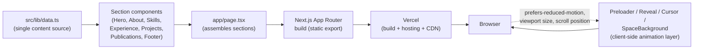

# Happy Prajapati — Portfolio

## 1) Project Overview

A personal portfolio site for showcasing applied software engineering
projects and academic ML research side by side, with the two kept visually
distinct so recruiters and researchers each see what's relevant to them
first. All content lives in a single typed data file, so new projects,
publications, or experience entries can be added without touching any
component code.

## 2) Features

- **Animated reload sequence** — a full-screen name reveal and staggered
  panel wipe plays once per page load, skipped automatically for users with
  reduced-motion enabled.
- **Scroll-triggered reveals** throughout every section (GSAP + ScrollTrigger),
  with a magnetic custom cursor on devices that support hover.
- **Project carousel** — swipeable/scroll-snap slider with arrow buttons,
  dot indicators, and keyboard navigation, built to scale as more case
  studies are added without growing the page.
- **Ambient canvas starfield** — twinkling stars and occasional shooting
  stars behind all content, pausing when the tab isn't visible.
- **Distinct sections for applied engineering vs. academic research** —
  coursework/team projects and published or in-progress research are kept
  visually and structurally separate.
- **One-click resume download** from the contact section.

## 3) Tech Stack

| Technology | Role |
|---|---|
| **Next.js 15 (App Router)** | React framework handling routing, static rendering, and the production build/deploy pipeline. |
| **TypeScript** | Type safety across components and the shared content model in `data.ts`. |
| **Tailwind CSS v4** | Utility-first styling, with design tokens (color, spacing, radius) defined once via the `@theme` block in `globals.css`. |
| **GSAP + ScrollTrigger** | Timeline-based animation for the preloader sequence and scroll-triggered section reveals. |
| **Framer Motion** | Declarative micro-interactions (hover/tap states on buttons and skill pills). |
| **lucide-react** | Icon set used in the Skills section. |
| **HTML5 Canvas** | Hand-rolled starfield background — chosen over a library since the effect (twinkle + occasional streak) is small enough that a dependency wasn't worth the bundle weight. |
| **Vercel** | Hosting and CI/CD — builds and deploys automatically on every push to `main`. |

## 4) Architecture

This is a static, content-driven frontend with no backend, database, or
external API — architecture here is about how content flows into rendered UI,
not services talking to each other.



Editing content never touches component code: update `data.ts`, and every
section that reads from it (stats, skills, projects, publications, education)
updates automatically.

## 5) Project Structure

```
portfolio/
├── public/
│   └── Happy-Prajapati-Resume.pdf   # served statically, linked from Footer
├── src/
│   ├── app/
│   │   ├── globals.css              # design tokens (@theme), base styles
│   │   ├── layout.tsx                # root layout, fonts, metadata
│   │   └── page.tsx                  # assembles all sections in order
│   ├── components/
│   │   ├── Preloader.tsx             # reload name-reveal + panel wipe
│   │   ├── SpaceBackground.tsx       # canvas starfield (fixed, z-0)
│   │   ├── CustomCursor.tsx          # magnetic cursor (fine-pointer only)
│   │   ├── Reveal.tsx                # reusable GSAP scroll-reveal wrapper
│   │   ├── Nav.tsx                   # persistent nav + CTA
│   │   ├── Hero.tsx                  # name, role, above-the-fold intro
│   │   ├── About.tsx                 # bio, education history, stats grid
│   │   ├── Skills.tsx                # categorized tech stack
│   │   ├── Experience.tsx            # work/research timeline
│   │   ├── Projects.tsx              # applied engineering carousel
│   │   ├── Publications.tsx          # academic research (kept separate)
│   │   └── Footer.tsx                # contact, resume download, links
│   └── lib/
│       └── data.ts                   # single source of truth for all content
├── next.config.ts
├── tsconfig.json
└── package.json
```

## 6) Installation & Setup

**Prerequisites:** [Node.js](https://nodejs.org) 18.18+ and npm. No database,
no environment variables, and no API keys are required — this project has
no backend.

```bash
# install dependencies
npm install

# run the dev server
npm run dev
```

Open [http://localhost:3000](http://localhost:3000). Reload the page to see
the intro animation — it only plays on a full page load, not on scroll.

```bash
# production build (what Vercel runs)
npm run build
npm run start

# lint
npm run lint
```

## 7) Usage

Visitors land on the Hero section with name and role immediately visible,
then scroll through About (bio, education, stats) → Skills → Experience →
Projects (swipe or use the arrow buttons/dots to move between case studies)
→ Research → Footer, where they can email directly or download the resume.
The nav bar and its anchor links jump straight to any section.

To update content as a maintainer: edit the relevant array or object in
`src/lib/data.ts` (e.g. add an entry to `projects` or `skillGroups`) — no
component changes needed for routine updates.

## 8) Screenshots / Demo

- **Live site:** _add your Vercel URL here once deployed_
- **Repository:** _add your GitHub URL here once pushed_

_Add a screenshot or two here once deployed — e.g. the Hero section and the
Projects carousel — so the README is visual before someone reads the code._

## 9) API Documentation

Not applicable. This project has no backend, database, or API routes — it's
a fully static site with all content sourced from `src/lib/data.ts` at build
time.

## 10) Engineering Decisions

- **Single content file over a CMS.** For a portfolio this size, a typed
  `data.ts` file gives the same "edit content without touching components"
  benefit as a CMS without the hosting, auth, or query-layer overhead.
- **Static generation over server rendering.** Nothing here is
  user-specific or frequently changing, so a static build lets Vercel serve
  every page from its CDN with no server compute per request.
- **GSAP for timeline-heavy animation, Framer Motion for micro-interactions.**
  Rather than picking one animation library for everything, each was used
  where it's strongest — GSAP's `ScrollTrigger` for scroll-driven reveals
  and the preloader sequence, Framer Motion for simple declarative
  hover/tap states.
- **Hand-rolled canvas starfield instead of a particle library.** The
  effect needed (twinkling dots + occasional streak) is simple enough that
  a full particle-system dependency wasn't justified — a ~150-line canvas
  component keeps the bundle smaller and the behavior fully controllable
  (e.g. pausing via the Page Visibility API when the tab isn't active).
- **Accessibility as a default, not an add-on.** Every animated component
  (`Preloader`, `Reveal`, `CustomCursor`, `SpaceBackground`) checks
  `prefers-reduced-motion` and degrades to an instant/static state rather
  than gating motion behind a separate settings toggle.
- **Carousel over a growing stack of cards.** Projects were originally
  listed as full-width stacked cards; switching to a scroll-snap carousel
  means the page height stays constant as more projects are added, instead
  of the page getting longer with every new case study.

## 11) Testing

There is no automated test suite for this project — for a static
content-driven marketing/portfolio site with no business logic, backend, or
data mutations, the practical risk (broken layout, build failure) is caught
more efficiently by the checks below than by unit tests.

What's actually verified, on every change:
- `npm run build` — a failed TypeScript or Next.js build is treated as a
  blocking error before shipping.
- `npm run lint` — ESLint (Next.js + TypeScript rules) run clean, no
  warnings ignored.
- Manual check in the browser at common breakpoints (mobile, tablet,
  desktop) after any layout change.

If this project grows a contact form or any server-side logic, that would
be the point to introduce component/integration tests (e.g. Playwright for
the carousel and preloader interactions).

## 12) Limitations & Future Improvements

**Current limitations:**
- Several project entries still link to placeholder (`#`) repository URLs
  until those repos are pushed.
- No automated tests, as noted above.
- The starfield and preloader are hand-tuned by eye rather than
  benchmarked for animation performance on low-end devices.

**Planned improvements:**
- Swap remaining placeholder project links for real GitHub/GitLab URLs as
  repos go public.
- Add the live demo link and screenshots once deployed to Vercel.
- Add the DANSA Lab paper's preprint/DOI link once it's published.
- Consider a lightweight analytics integration (e.g. Vercel Analytics) to
  see which sections/projects visitors actually engage with.
